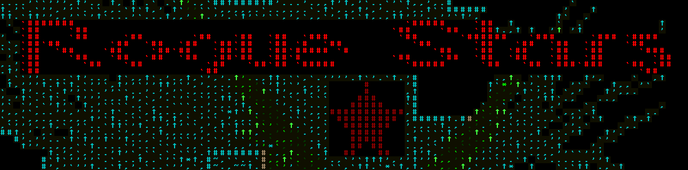

# Rogue Stars

## About

Rogue Stars is a space simulation roguelike.

* Date of creation: 4/20/2017

* Progress to a completed game: 3%

* Version: 0.1.1

## How To Build

Download libtcod and extract the following files to the build directory:

* libtcod.dll

* SDL2.dll

* terminal12x12_gs_ro.png

Open the .sln file with Visual Studio 2017 and then compile.

## Contributing

Fork

