Rogue Stars is a space roguelike that will (is planned to) include vast space exploration, dynamic simulation, factional warfare,  randomly generated **everything**™, and complex roguelike mechanics.

Current progress to a completed game: 1%

Current version: 0

This project was born on: 4/10/2017

If you would like to contribute, pm this guy on reddit ---> https://www.reddit.com/user/pepperonion

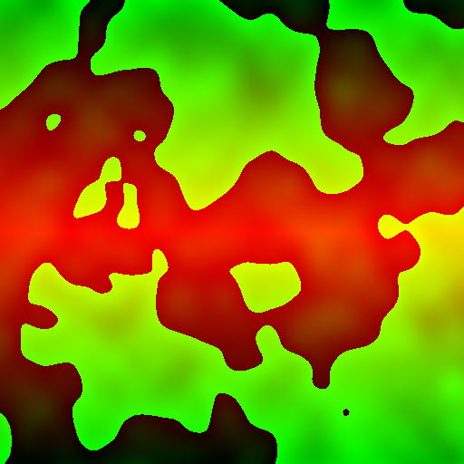

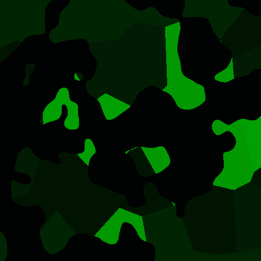

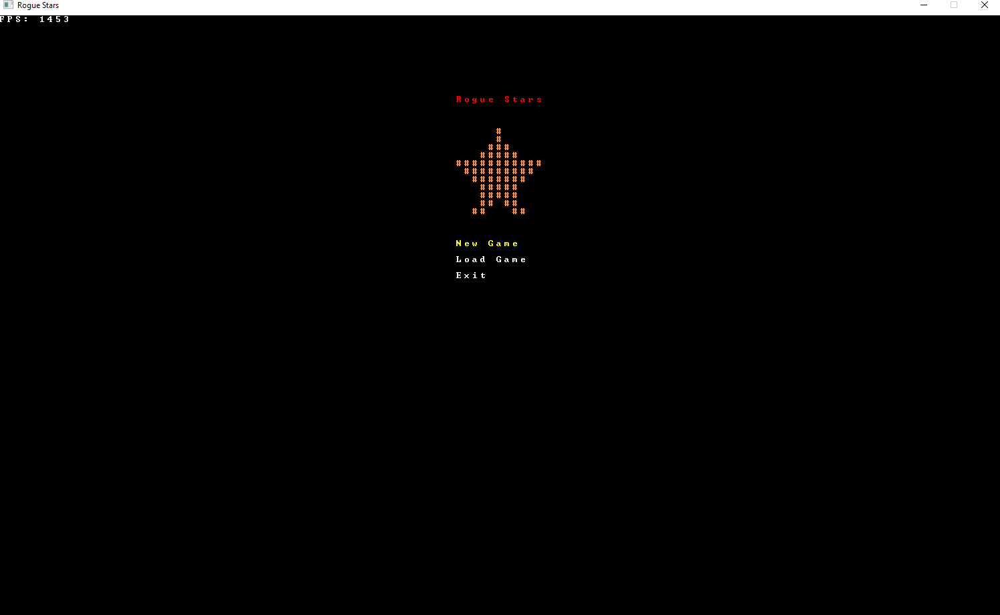

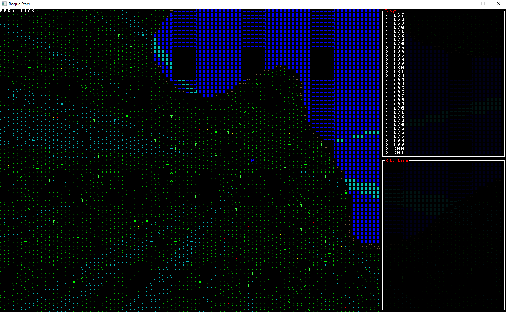

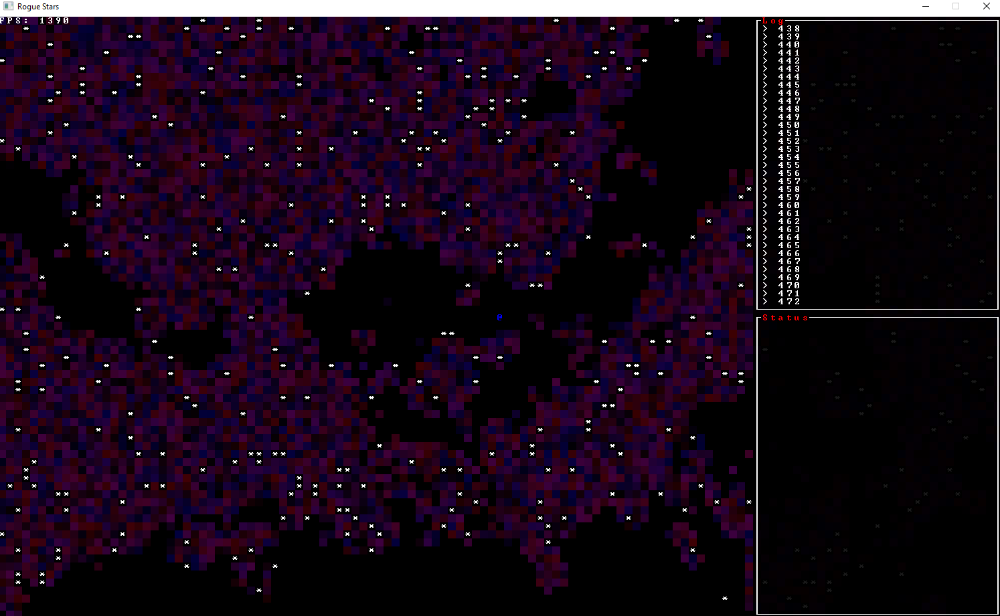

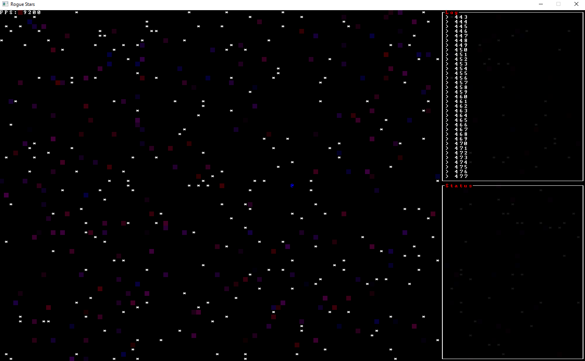

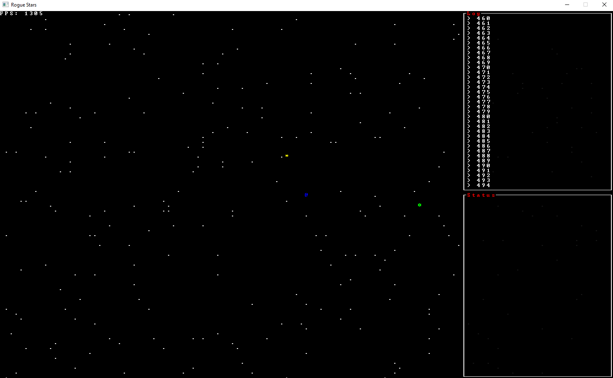

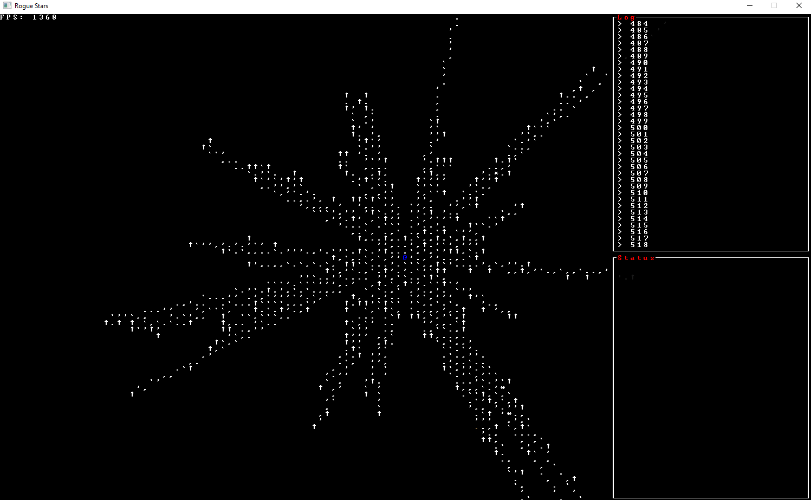

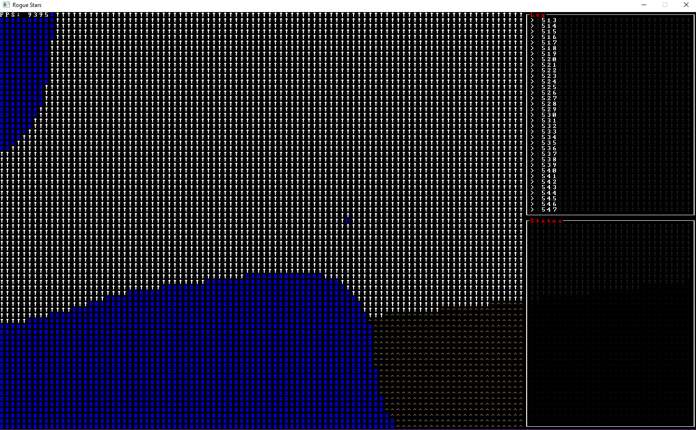

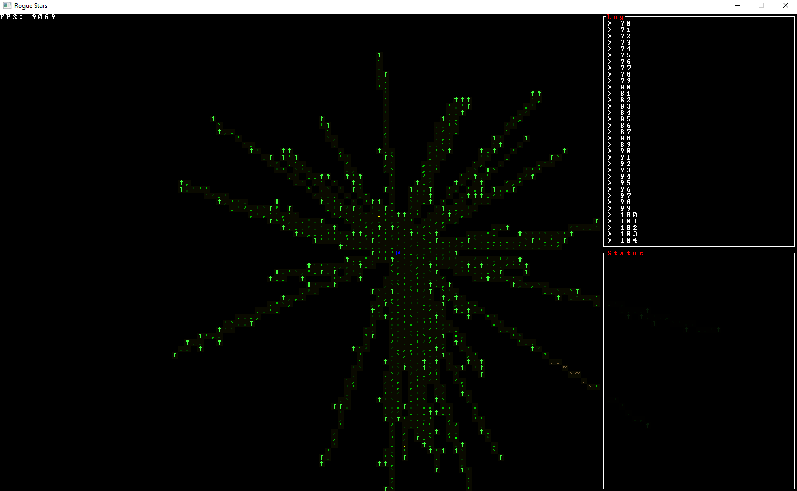

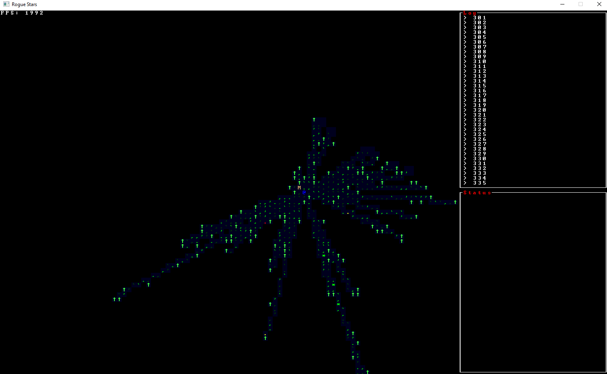

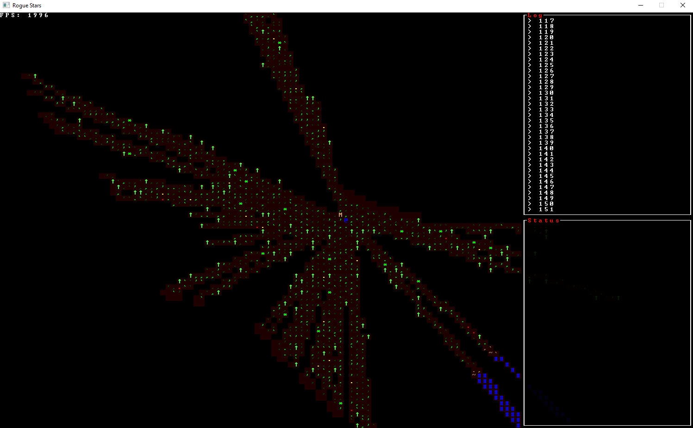

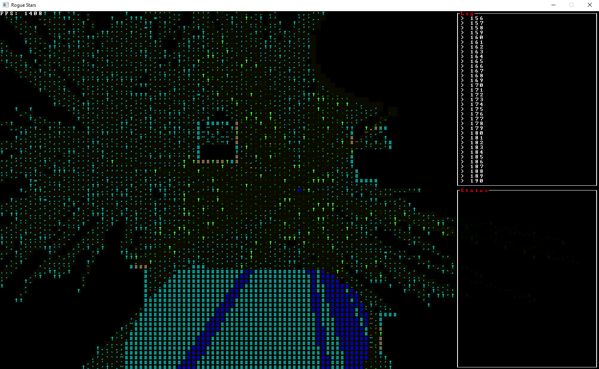

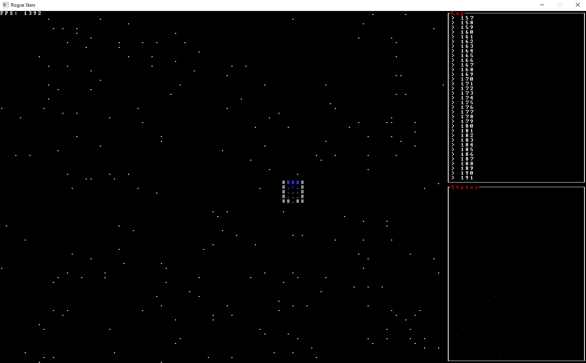
